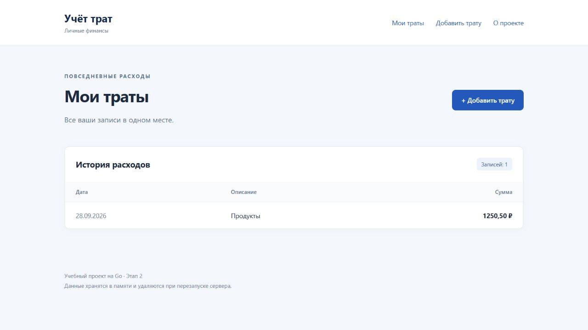

# Учёт личных трат

Учебное веб-приложение на Go: список личных расходов и форма добавления. Выполнены этапы 1 и 2. Сторонних библиотек и базы данных нет; после перезапуска список очищается.

## Запуск в РЕД ОС

Нужен Go 1.22 или новее. Проверьте `go version`. При необходимости установите пакет `golang` через менеджер пакетов вашей версии РЕД ОС либо Go с https://go.dev/dl/.

```bash
git clone https://github.com/svgamings19-ux/----22.git
cd -- ----22
go run .
```

Откройте http://localhost:8080. Остановка — Ctrl+C. Альтернативный запуск из корня: `go run ./cmd/expenses`. Если порт 8080 занят, остановите предыдущий экземпляр сервера.

## Этапы и структура

- [Этап 1](https://github.com/svgamings19-ux/----22/tree/a08817283a407ca8bec8ebae1d12e48f700600f1) — самостоятельная версия простого HTTP-сервера. Для просмотра: `git switch --detach a08817283a407ca8bec8ebae1d12e48f700600f1`; вернуться: `git switch main`.
- `main` — этап 2: интерфейс на HTML-шаблонах поверх этапа 1.
- `cmd/expenses` — точка входа; корневой `main.go` сохраняет удобный запуск `go run .`.
- `internal/app` — запуск сервера.
- `internal/handlers` — маршруты, обработка форм и срез трат с блокировкой для параллельных запросов.
- `internal/models` — структура `Expense` с суммой в копейках, описанием и датой.
- `web/templates` — общий layout и шаблоны страниц; `web/static` — CSS.
- `docs` — отчёты и скриншоты.

Шаблоны и CSS встраиваются через `embed`, поэтому собранная программа не зависит от текущей папки. Имя модуля заканчивается на `/expenses`: имя самого репозитория `----22` не подходит для имени Go-пакета.

## Маршруты

| Метод | Путь | Результат |
|---|---|---|
| GET | `/`, `/expenses` | Список трат |
| GET | `/expenses/new` | Форма добавления |
| POST | `/expenses/new` | Добавление и 303 на `/expenses` |
| GET | `/about` | Описание проекта |
| GET | `/ping` | 200 и `pong` |
| Другой метод | `/ping` | 405 и `Allow: GET` |

## Проверка

```bash
go test ./...
go vet ./...
curl -i http://localhost:8080/ping
curl -i -X POST http://localhost:8080/ping
curl -i -d 'amount=350.50&description=Lunch&date=2026-09-28' http://localhost:8080/expenses/new
```

После последней команды ожидаются `303 See Other` и `Location: /expenses`. Откройте список, обновите страницу: запись остаётся единственной. Остановите и снова запустите сервер: список пуст. При наличии C-компилятора также можно запустить `go test -race ./...`.

## Скриншот этапа 2

Тестовая запись добавлена через браузер; она не встроена в исходный код.



Отчёты: [этап 1](docs/stage1.md), [этап 2](docs/stage2.md). Результаты выполненных проверок: [docs/verification.md](docs/verification.md).
